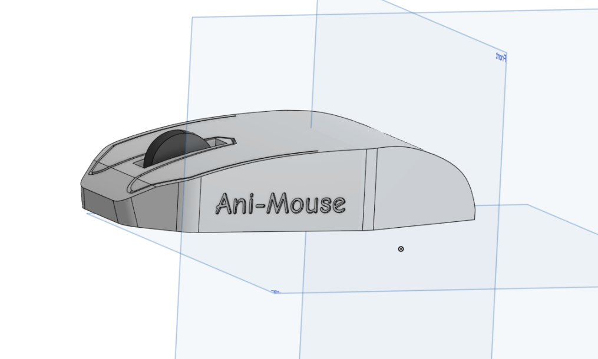
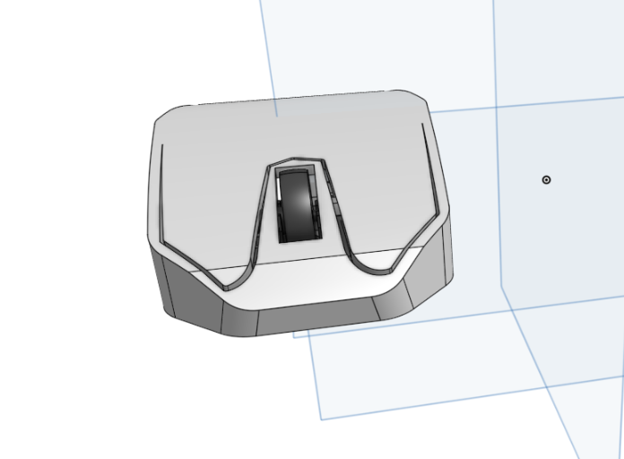
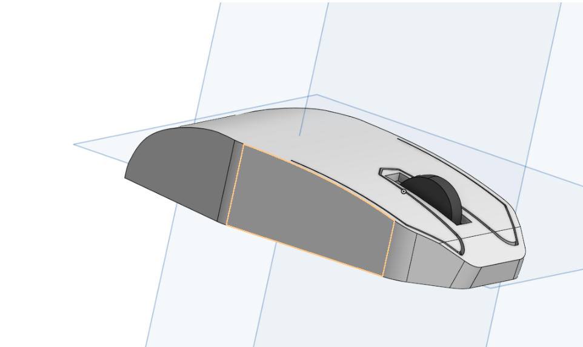
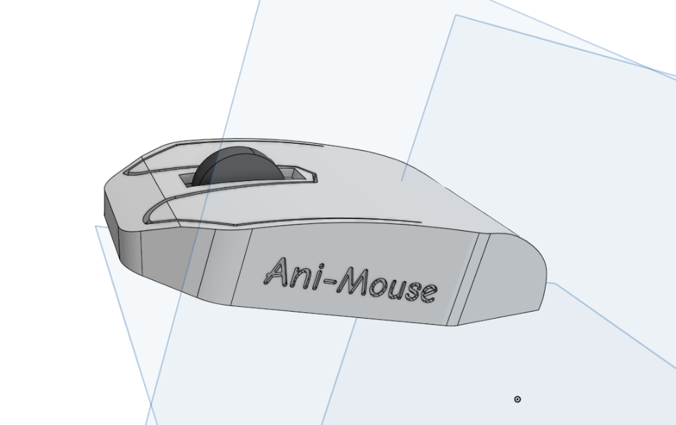
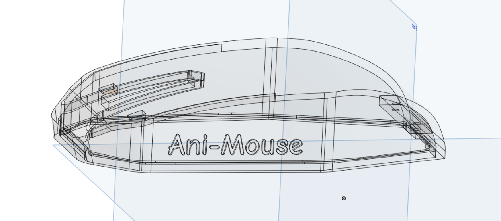

# Ani-Mouse

### Why did I make it?
I wanted to learn something cool and which requires CAD and improves my skills.

### What was the hardest part about this ?
The hardest part was probably the CAD it's only thing in this project but it wasn't really hard but it wasn't really easy too, it took time to figure things out.

### Front

### Right

### Left

### Design

### Bill of Material
| Name                                                          | Qty | Price in USD | Link                                                                             |
| ------------------------------------------------------------- | --- | ------------ | -------------------------------------------------------------------------------- |
| Bambu Lab Mouse Kit                                           |  1  |      13      | [here](https://us.store.bambulab.com/products/wireless-mouse-components-kit-002) |
| 3d Prints                                                     |  1  |      N/A     | PRINT LEGION                                                                     |

## Total Pricing
The total price comes out to be 13$

The pricing might slightly vary due to flash sales, and dollar market trends.
